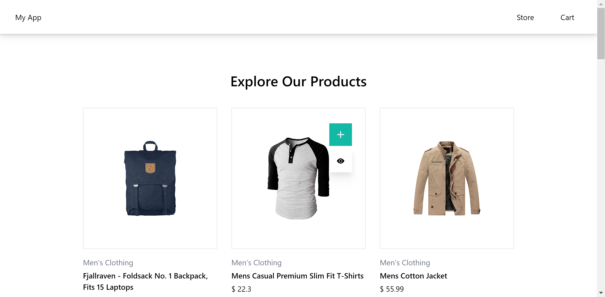

<h3 align="center"> Ecommerce Web Application</h3>
<p align="center">
    An Ecommerce front end set up with react, typescript,tailwind,redux and jest.
<br/>
<br/> 


## Table of Contents

- [Table of Contents](#table-of-contents)
- [About The Project](#about-the-project)
  - [Built With](#built-with)
- [Getting Started](#getting-started)
  - [Prerequisites](#prerequisites)
  - [Installation](#installation)
- [Roadmap](#roadmap)

## About The Project



you will be able to list the products and  manage your cart, just basic actions

### Tech Stack
- [React](https://react.dev/)
- [Typescript](https://www.typescriptlang.org/)
- [redux](https://redux.js.org/)
- [tailwindcss](https://tailwindcss.com/)
- [webpack](https://webpack.js.org/)
- [jest](https://jestjs.io/)
- [sass](https://sass-lang.com/)
- [RTK Query](https://redux-toolkit.js.org/rtk-query/overview)

## Getting Started


### Prerequisites

This project requires node 18 above version to be installed in your system. 

### Installation

Please follow the following steps for successful installation:

1. **Clone the Repository:** Get started by cloning the repository to your local machine.

   ```
   git clone https://github.com/ManuSunny18/manu-ecommerce-app-test.git
   ```

2. **Install Frontend Packages:** Navigate to the &quot;/manu-ecommerce-app-test&quot; directory and install the required npm packages by executing the following command in your terminal:

   ```sh
   npm install
   ```

3. **Run :** After Successfull installation of npm modules, run below command to start the application in development mode
   ```sh
   npm start
   ```

   Now, your application should be successfully up and running!

## Project Overview
    package.json
        start : To run the project in development mode
        build : Will generate the optimized bundle for the production
        analyse : Can analyse the bundle size and dependencies 
        test : run test cases
    webpack
        development and production build configurations
    tailwind.config.js
        front end design system configuration
    src
        assets
            for images and fonts
        common
            resusable react ui components (loaders, buttons, modals...)
        components
            common components specific the application (product, cart, filters etc..)
        layout
            html structure to render the ui
        pages
            all the route pages
        store
            redux store to manage the state
        types
            typescript utils
        api
            all the api query set up goes here

## Roadmap

We just completed a basic set up to start the development process, however api layer, caching all set up need to be completed.


- [x] Add react typescript tailwind
- [x] Add Api middleware
    - [ ] lazy query / mutate hooks
    - [ ] caching
    - [ ] Api end points to env
- [x] Add redux 
- [x] Testing set up
  - [x] regular component testing samples
  - [x] mock data for product listing
  - [ ] redux testing
  - [ ] user event testing
- [x] Paginated store page
- [ ] virtualised pagination for store page to improve the perfomance
- [ ] Saving the cart informaion
- [ ] PWA
- [ ] Replace useEffect with react query
- [ ] Add assets caching
- [ ] gzip setup
- [ ] minimize the images
- [ ] static server setup

